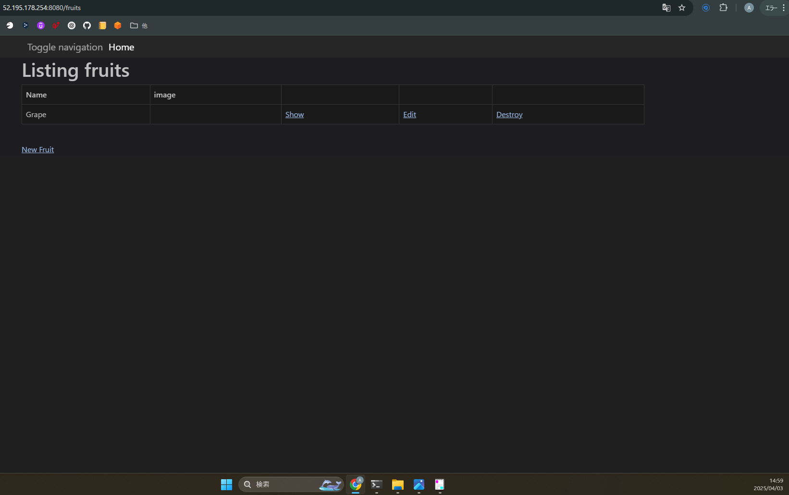
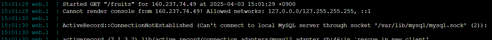
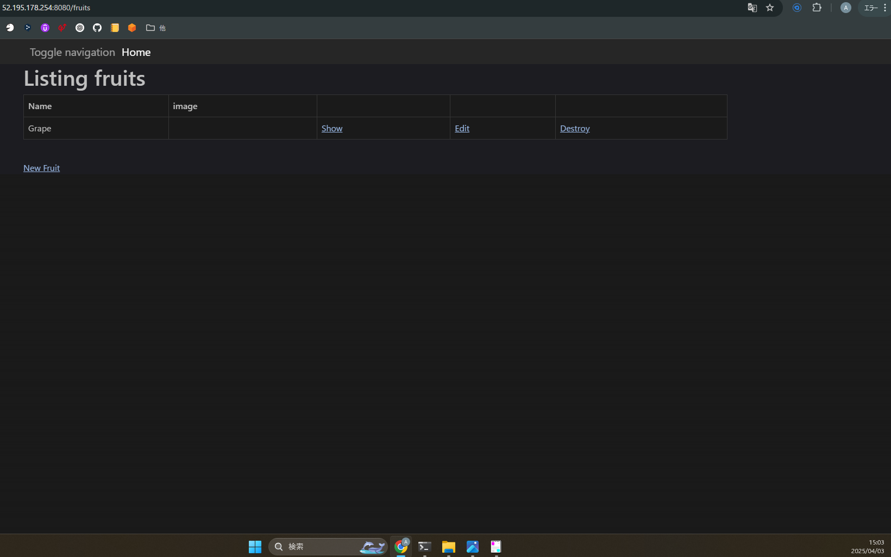

## 課題の回答

### 1.今回起動したAPサーバー
- サーバー名: Puma（バージョン6.4.2）

- APサーバーの開始・終了時
  - 開始時: Webブラウザからアプリへアクセス可能
    
    

  - 終了時: Webブラウザからアプリへアクセスできなくなる（接続拒否のエラーが発生）
    
    

  - 再開時: Webブラウザからアプリへアクセス可能
     
    

### 2.今回起動したDBサーバー
- サーバー名: MySQL（バージョン8.4.4）
[mysql](images/mysql.png)
[mysql-2](images/mysql_2.png)

- DBサーバーの開始・終了時
  - 開始時: Webブラウザからアプリへアクセス可能
    
    
    
  - 終了時: Webブラウザからアプリへアクセスできなくなる（MySQLサーバーに接続できないエラーが発生）
    
    
    

  - 再開時: Webブラウザからアプリへアクセス可能
    
    

- Railsの構成管理ツール: Bundler
  - ライブラリである「gem」の依存関係を管理するツール

---

## Webアプリケーションの仕組み

### Webアプリケーションとは
- Webアプリとは、端的に言うとブラウザ上で利用できるアプリケーションのことを指す。
- クライアントであるブラウザとサーバー間のリクエストとレスポンスの応酬で成り立つ。

### リクエストとレスポンス
- Webアプリケーションの場合、クライアントからサーバーへHTTP Requestを送信し、サーバーからクライアントへHTTP Responseを返す。
- よく使われる仕組みとしてAPIも存在し、所定のデータを取り出したり送信したりできる。他のアプリケーションの機能の一部を取り込めるようなイメージ。
- サーバーから取得した情報を扱いやすくするために、言語ごとのフレームワークがある。Rubyのフレームワークなど。

### HTTP通信
- ブラウザからWebアプリケーションを動かす場合はURLが必要で、URLとはリクエスト先のサーバーの場所を指し示すURIの一部である。
- HTTPでの通信フォーマットにはJSONやXMLがあり、JSONの方がデータ量が少ないため高速にやり取りができる。
- HTTP Requestを送る際、どのような処理を行うかをサーバーに伝えるために「GET」「POST」などのHTTPメソッドを使う。
        - GETメソッド: 情報を取得したい時に使う | POSTメソッド: 情報をPOSTし、登録・更新などを行いたい時に使う。

### HTML/CSS/Java Script
- HTMLはブラウザで画面描画を行う時に使うマークアップ言語。
- CSSはHTMLで書かれたものをスタイリング（飾り付け）する。
- JavaScriptはブラウザ上でのアニメーション表現などを行いたい時に使うプログラミング言語。
- HTML/CSS/Java Scriptにもバージョン、ライブラリ、フレームワークがある。

## Rubyとアプリケーションの構成要素

### Ruby on Rails
- Railsのフレームワークはある機能を実装するうえで必要な記述がまとまっている。設定ファイルなどの記述を減らすことができる。
- Railsアプリケーションは実行ファイル1つでなく、複数ファイルによって構成されている。

### 外部ライブラリと構成管理
- 外部ライブラリとは「他の誰か」が作った「便利機能」の集まりのようなもの。
- 構成管理ツールを活用することで必要なライブラリを入手できる。依存関係を定義すると自動的に外部ライブラリとして追加される。
- Rubyのリモートリポジトリに当たるのはRubyGemsで、ここからモジュールやフレームワークを入手して利用する。

### GemとBundler
- RubyのライブラリをGem、構成管理ツールをBudlerと呼ぶ。
- Bundlerを利用することでアプリケーションに必要なライブラリを必要なバージョンでダウンロード可能。

### アプリケーションサーバー
- アプリケーションサーバーとは、RubyやJavaなどのプログラム言語で書かれたアプリケーションを実行するために必要なサーバーのこと。
- アプリケーションサーバーは言語によって異なり、Javaの場合はApache Tomcat、Rubyの場合はPumaなど。
- フレームワークを使う際に「組み込み」と呼ばれる内蔵型のアプリケーションサーバーを使うこともある。
- Railsでも「rails s」でアプリケーションを起動すると、組み込みサーバーのPumaが起動する仕組みとなっている。

### DBとSQL
- Web系ではMySQLやPostgreSQLを使うことが多い。
- DB専門のエンジニアでなくても、SQLを実行することもある。まずは調べながらSQLを叩ければ十分。
