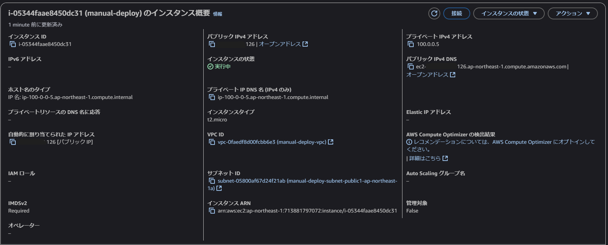
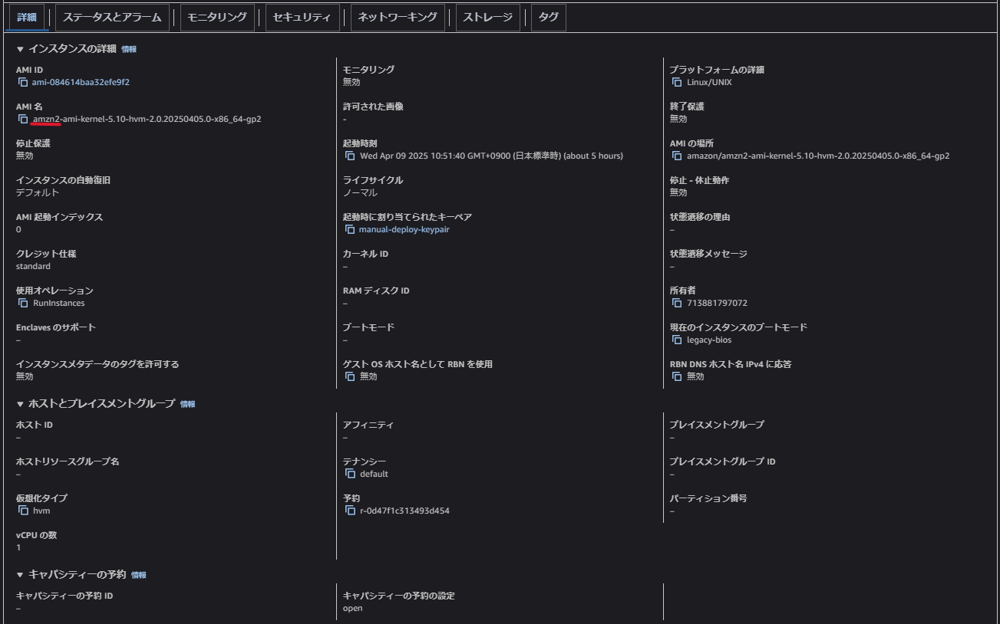
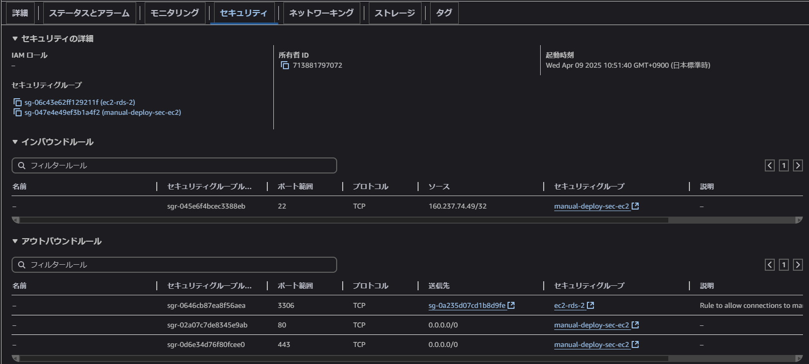

## 課題の回答

### 1.今回作成したVPC
- アベイラビリティーゾーン: ap-northeast-1a, ap-northeast-1c
- サブネット: AZごとにプライベートサブネット×1、パブリックサブネット×1

### 2.今回作成したEC2
- AMI: Amazon Linux 2
- インスタンスタイプ: t2.micro
- プライベートIPアドレス: 100.0.0.5
- パブリックIPアドレス: 自動割り当て

- セキュリティ
  - インバウンドルール: SSH通信を許可（ローカルPCからのみ）
  - アウトバウンドルール: HTTP通信とHTTPS通信を許可（全宛先）、RDSへの通信を許可（構築したRDS宛てのみ）

- ネットワーク
  - アベイラビリティーゾーン: ap-northeast-1a
  - サブネット: パブリックサブネット

- ストレージ
  - ボリュームサイズ: 16GiB

### 3.今回作成したRDS
- エンジン: MySQL Community

- ネットワークとセキュリティ
  - アベイラビリティーゾーン: ap-northeast-1a
  - パブリックアクセス: なし

- セキュリティ②
  - インバウンドルール: EC2からの通信を許可（構築したEC2からのみ）

### 4.EC2-RDS間の通信
- EC2上にMySQLクライアントをインストール済み

- EC2からRDSへログインできることを確認

