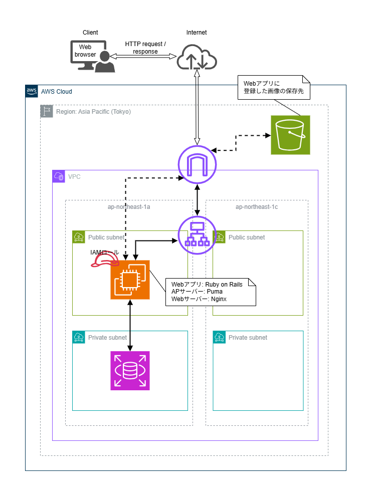
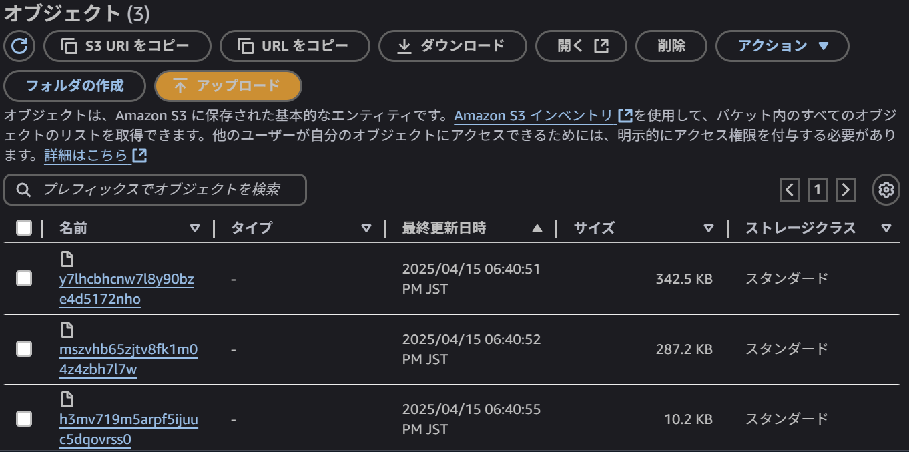

## 課題の回答

### 構成図

***

### デプロイの順序・詳細

#### 1.組み込みサーバー(Puma)だけでアプリを起動
- スクリプトで起動した場合 →3000番ポート指定でブラウザからアクセス可能

- systemdで起動した場合 →3000番ポート指定でブラウザからアクセス可能

#### 2.組み込みサーバー(Puma)＋Nginxでアプリを起動
- Pumaを起動

- localhost指定でNginxを起動 →80番ポート指定でブラウザからアクセス可能

#### 3.ALBを追加し、ALB経由でアプリへアクセス
- プロトコル:HTTP、ポート:80、アベイラビリティーゾーン:ap-northeast-1a、ap-northeast-1c

- DNS名指定でNginxを起動 ※この画像ではDNS名指定での起動設定に変更後、Nginxを再起動しています

#### 5.S3を追加し、アプリ上で登録した画像をS3へ保存
- S3へのパブリックアクセスはブロックし、EC2にIAMロールを付与

- 画像がS3に保存されていることを確認

