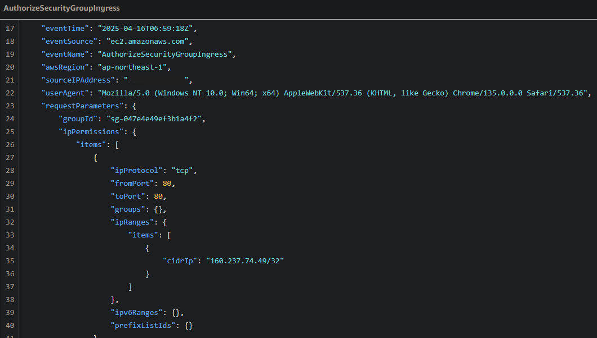
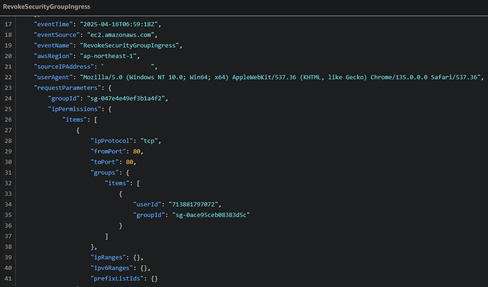

## 課題の回答

### 1.CloudTrail
#### イベント履歴

- StartInstances
  - インスタンスを起動した時のイベント履歴

- AuthorizeSecurityGroupIngress
- RevokeSecurityGroupIngress
  - セキュリティグループの設定を変更した時のイベント履歴
  - 時刻が同じなので、同じタイミングでルールの追加と削除を行っている

### 2.CloudWatchアラーム
#### アラーム設定
- 対象およびメトリクス：ALB/ UnhealtyHostCount
- 閾値：300 秒あたりに 1 以上

- アクション：OKの時とアラーム状態の時にメール通知する

#### 検証結果
- Railsアプリが使えない状態の時
  - 「アラーム状態」のステータスとなり、「ALARM」の通知メールが届いた

- Railsアプリを起動した時
  - 「OK」のステータスとなり、「OK」の通知メールが届いた

### 3.コスト
#### 利用料の見積もり
- 見積もり対象
  - 対象のリソースはVPC/EC2/ALB/RDS/S3とする
  - EC2は週に30時間、RDSは毎日起動し停止しない前提とする

- 見積もりURL
https://calculator.aws/#/estimate?id=23ac863377e34d1d1e7dce23cb12069c0735efb1

#### 現在の利用料
- 先月のEC2の利用料: 9.13$
- 無料利用枠を超えたリソース
  - EC2、ELB、VPC（Public IPv4アドレス）
  - EC2を適宜停止していなかったため、無料枠を超過していた

