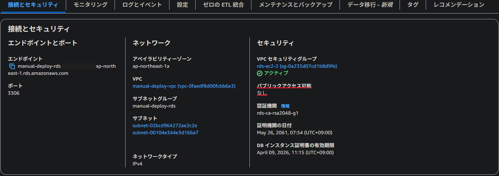

## 課題の回答

### まとめ
- 構築した環境のセキュリティ上の脅威と対策をまとめる。

| No | 箇所 | 脅威 | 対策 | 対応履歴 |
|-----|-----|-----|-----|-----|-----|
| 1 | ALB | 不正アクセス | 適切なインバウンド/アウトバウンドルールを設定する | 既に対応済み |
| 2 | EC2 | 不正アクセス | 適切なインバウンド/アウトバウンドルールを設定する | 既に対応済み |
| 3 | RDS | 不正アクセス | 適切なインバウンド/アウトバウンドルールを設定する | 既に対応済み |
| 4 | S3  | 不正アクセス | アクセス元のEC2に適切なIAMロールを設定する | ★今回対応 |
| 5 | S3  | 不正アクセス | 適切なバケットポリシーを設定する | ★今回対応 |
| 6 | アプリケーション | 認証情報の流出 | DBパスワードをCredentialsで管理する  | ★今回対応 |
| 7 | アプリケーション | 不正アクセス | 意図しないファイルアクセスを拒否する | ★今回対応 |

### AWSリソース関連
- インバウンド/アウトバウンドともに必要な通信のみ許可する。
- S3についてはIAMロールとバケットポリシーでアクセス権限を絞り込む。

1. ALB
- インバウンド：ポート80で、全ての通信を許可する。（Webアプリとして不特定多数のクライアントからHTTPリクエストを受け付ける想定で構築しているため）
- アウトバウンド：ポート80で、EC2宛ての通信のみ許可する。

2. EC2
- インバウンド：ポート80はALBから、ポート22はマイIPからの通信のみ許可する。
- アウトバウンド：ポート3306はRDS宛ての通信のみ許可する。ポート80と443は全宛先への通信を許可する。（パッケージ更新等のため）

3. RDS
- インバウンド：ポート3306で、EC2からの通信のみ許可する。
- アウトバウンド：ルールを設定しない。（ステートフルにつき、上記インバウンドルールに対する戻りの通信は明示的に設定不要のため）

- パブリックアクセスを許可しない。

4. S3（EC2のIAMロール）
- As is: アクセス権限が「AmazonS3FullAccess」になっている。
- To be: IAMポリシーを作成し、アクセス権限を以下の通りに絞り込む。
  - s3:GetObject
  - s3:PutObject
  - s3:DeleteObject
  - s3:ListBucket

5. S3（バケットポリシー）
- As is: バケットポリシーを設定していない。
- To be: バケットポリシーでアクセス元をIAMロールに変更し、権限を以下の通りに絞る。
  - s3:GetObject
  - s3:PutObject
  - s3:DeleteObject
  - s3:ListBucket

### アプリケーション関連
- DBのログイン情報などは環境変数に格納すべきではないとの指摘を発見したため、RailsのCredentialsで管理するよう変更する。
- Railsのログに.envなどのファイルを狙ったアクセス履歴があったため、Nginxのconfファイルで意図しないファイルアクセスをブロックする。

6. 認証情報の管理
- As is: RDSのログイン情報を環境変数に格納している。
- To be: RDSのログイン情報をRailsのCredentialsで管理する。
  - Credentialsファイルを編集する。
  - config/database.ymlを修正する。
  - 併せてconfig/storage.ymlも修正する。（S3バケットもCredentialsで管理）

7. ファイルアクセスの管理
- As is: 不特定多数のファイルアクセスを受け付ける設定になっている。
  - Railsのログに.envなどを狙ったアクセス履歴があった。

- To be: 意図しないファイルアクセスをブロックする。
  - 「/etc/nginx/conf.d/default.conf」に以下の通り追記する。

