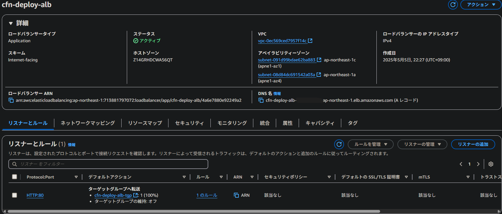
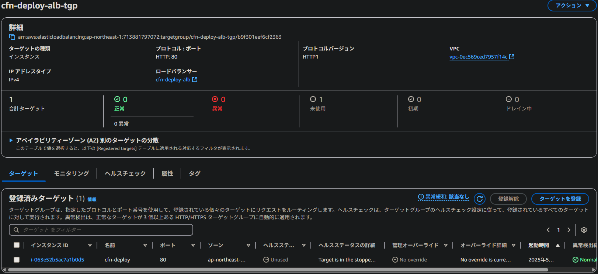

## 課題の回答

### まとめ
- CloudFormationテンプレートを作成し、VPC・EC2・ALB・RDS・S3を構築した。

- 以下の通り、RDSとS3への接続を確認した。（ALBのヘルスチェックはlecture13でアプリをデプロイ後、確認予定）
  - 構築したEC2にMySQLクライアントをインストールし、DBに接続できることを確認した。

  - 構築したEC2からS3にアクセスし、バケットの内容を表示できることを確認した。

### 1.VPC
- アベイラビリティーゾーン: ap-northeast-1a, ap-northeast-1c
- サブネット: AZごとにプライベートサブネット×1、パブリックサブネット×1

### 2.EC2
- AMI: Amazon Linux 2
- インスタンスタイプ: t2.micro
- プライベートIPアドレス: 200.0.0.27
- パブリックIPアドレス: Elastic IPアドレスを割り当て

- インバウンドルール: ポート22→ローカルPCからのみ通信を許可、ポート80→ALBからのみ通信を許可
- アウトバウンドルール: ポート80・443→全宛先への通信を許可、3306番ポート→RDS宛てのみの通信を許可

### 3.ALB
- リスナー: ポート80でターゲットグループcfn-deploy-alb-tgp宛て
- ターゲットグループ: 構築したEC2（i-063e52b5ac7a1b0d5）が対象

- インバウンドルール: ポート80で、全ての通信を許可
- アウトバウンドルール: ポート80で、EC2宛ての通信のみ許可

### 4.RDS
- エンジン: MySQL Community
- アベイラビリティーゾーン: ap-northeast-1a
- パブリックアクセス: なし

- インバウンドルール: 3306ポート、構築したEC2からのみ通信を許可

### 5.S3
- パブリックアクセス: ブロック

- IAMロール: 対象のS3でオブジェクトの取得・配置・削除と一覧表示を許可

