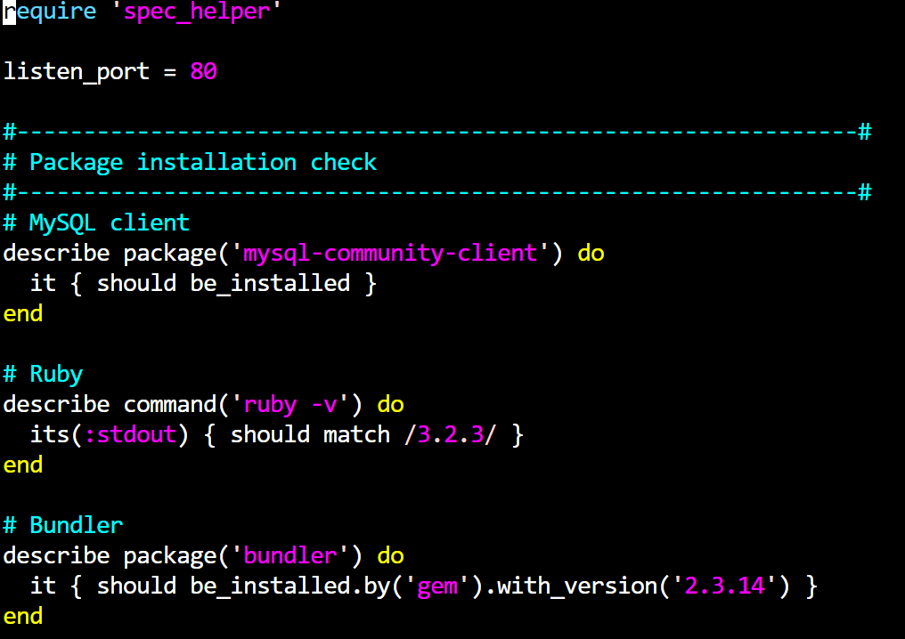
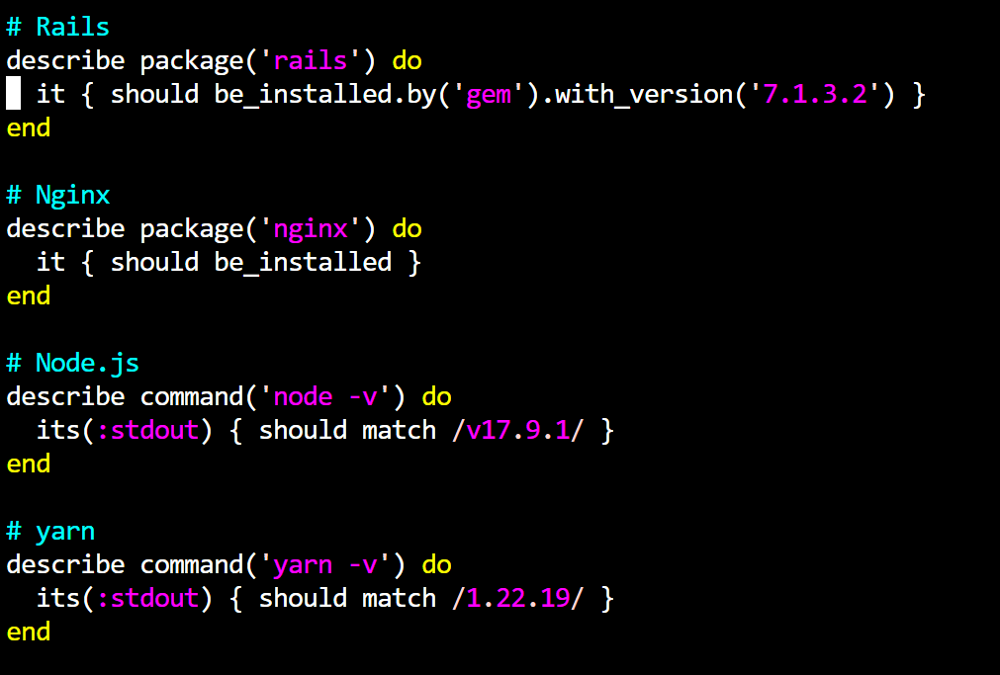
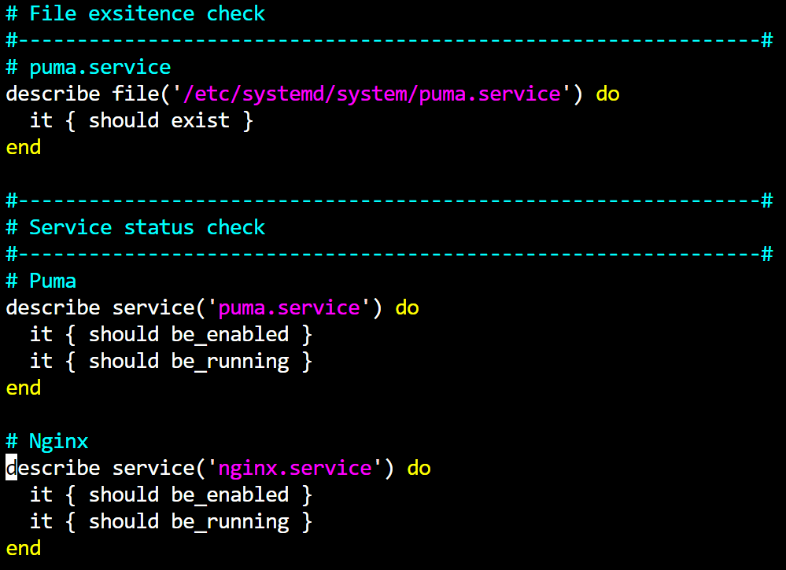
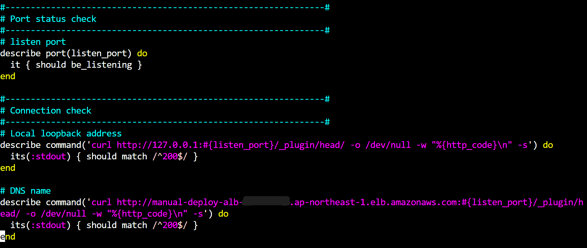
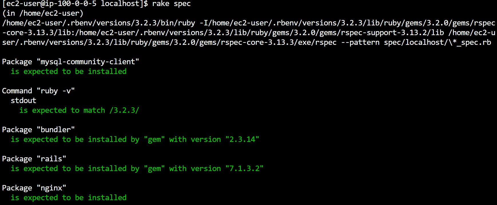
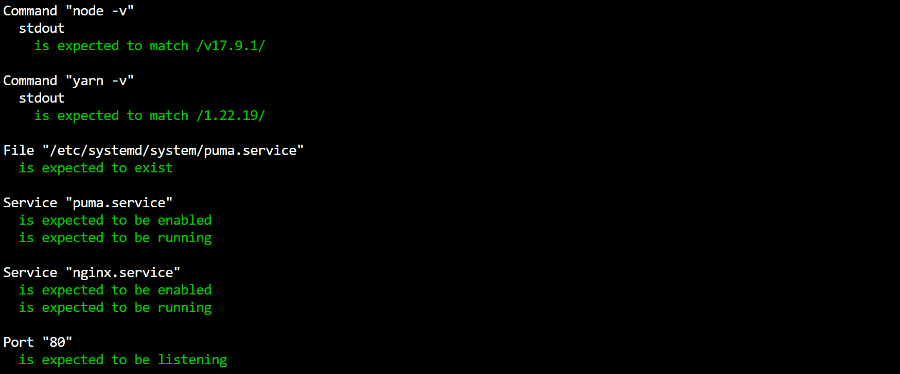
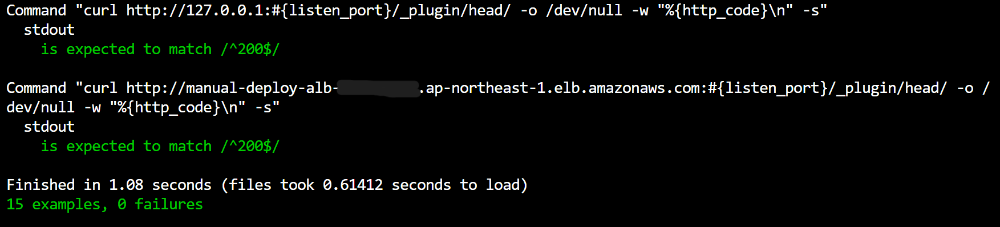
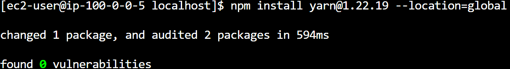

## 課題の回答
- lecture05でWebアプリをデプロイしたEC2環境上にServerSpecをインストールし、テストを実施した。

### テスト内容
- 各パッケージがインストール済みかどうか

- 指定のファイルが存在するかどうか
- サービスが常時起動の設定になっていて、今も起動中かどうか

- 指定のポートが開いているかどうか
- 指定のIPアドレス等に疎通確認ができるかどうか

### テスト結果
- 全ての試験項目をクリアしていることを確認した。

