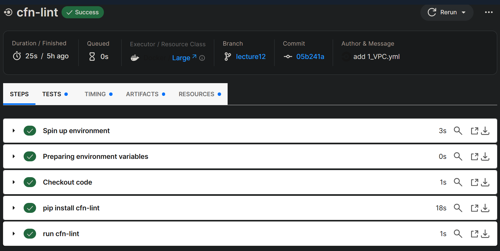

## 課題の回答
- サンプルコンフィグ`.circleci/config.yml`をGitHubの`raisetech_aws`リポジトリに組み込んだ。
- lecture10で作成したCloudFormationテンプレートを配置後にコミット（リモートリポジトリへpush）し、`cfn-lint`によるチェックが行われたことを確認した。

## 確認結果
- push後、パイプライン上の処理がSuccessになったことを確認。

- ワークフロー`raisetech`内のジョブ`cfn-lint`の処理が全て正常終了したことを確認。

